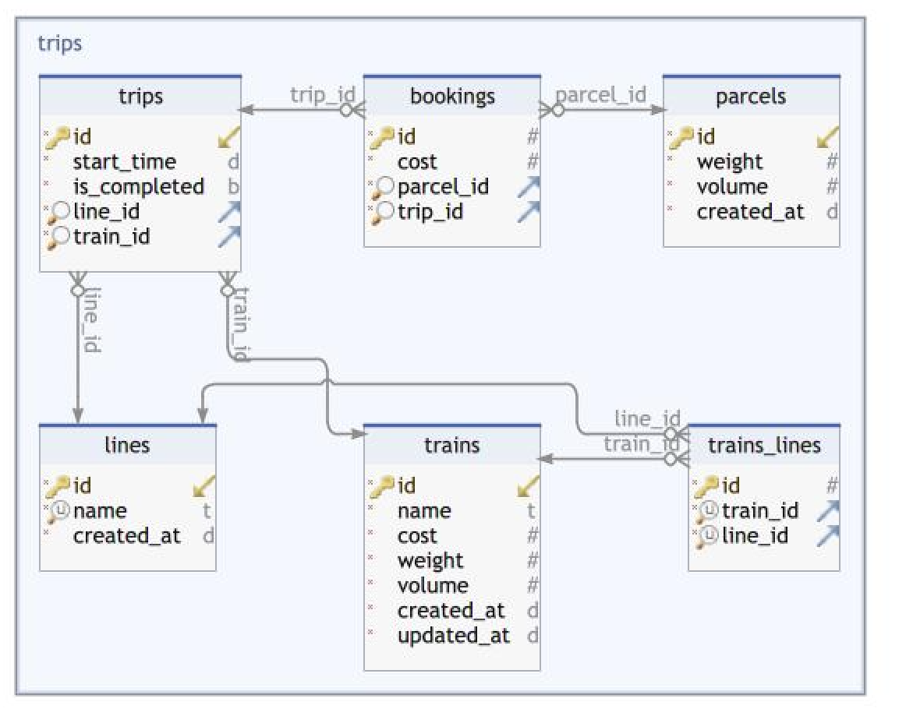

## LONG MAIL SERVICE

This is a service for scheduling mails on trains in a cost optimised technique.

## Schema Design

Below is the schema design of the application



### Schema details

- **Train**: Details about train 
- **Parcel**: Parcel Info
- **Line**: Info about line
- **Trains_Lines**: Many-to-Many relation b/w trains and lines
- **Trip**: Trains taking trip to deliver parcel at which line, at start_time, and it completed or not.
- **Booking**: Contains parcels booking in which train id, one-to-many relation b/w trip and bookings.

## Design Pattern

We have used **_domain driven design pattern_** to create this application. Different layers in the application are:
- **Service**: Coordination with models and business logic is present. Present inside the _service_ _folder_
- **Api**: Public functions and access points, presentation logic. Present in _api.py_ file
- **Models**: Object models and storage, simple information logic Present in _models.py_ file.

## Installation
 You can use any virtual environment of your choice to execute this application. I have used **_python == 3.10.4_** for 
 development purpose.

You can install all the dependencies from the file _requirements.txt_


## Test Case

Django inbuilt used unittest to create testcases. We have created following two type of test cases here:
- **Unit test**: These are test written to test the base classes and features of application. Present inside the folder _service/test_unit_
- **Integration test**: These are written to test the integrations b/w api and service layer. Present in file _test_integrations_

Below the commands to **run** test cases and check **coverage**

```cmd
coverage run ./manage.py test long_mail_service
coverage report 
```

## CLI Description

Following are the CLI commands created to check application. You can also use **_--help_** to check documentation on APIs

- **Create train**: This api is used to create train in the system. 
  - All the parameters are required.
  - It returns the _train id_ which is used in further API calls.


```cmd
 python manage.py create_train --name train1 --cost 100 --volume 200 --weight 500 --lines A B
```

```python
{'id': 1, 'name': 'train1', 'cost': 100, 'weight': 500, 'volume': 200, 'created_at': '2023-10-02T09:17:28.530689Z', 'updated_at': '2023-10-02T09:17:28.532229Z', 'lines': [1, 2]}
```

- **Train Details**: This api is used to get information about the train. 
  - _train id_ is required to get this information.
  - It returns all the details related to train.
  - _Trip_: details about trip, _is_completed_: is trip completed, _parcels_: details of all parcels present in this trip 


```cmd
python manage.py train_details --train-id 2
```

```python
{"train": {"id": 1, "unit_cost": 50.0, "name": "train1", "cost": 100, "weight": 500, "volume": 200, "created_at": "2023-10-02T09:17:28.530689Z", "updated_at": "2023-10-02T09:17:28.532229Z", "lines": [1, 2]}, "trips": [{"id": 2, "end_time": NULL, "start_time": "2023-10-02T09:54:12.422179Z", "is_completed": false, "train": 1, "line": 1, "parcels": [{"cost": 125.0, "id": 2}]}]}
```


- **Create Parcel**: This api is used to create parcel in the system. 
  - All the parameters are required.
  - It returns the _parcel id_ which is used in further API calls.

```cmd
 python manage.py create_parcel --volume 20 --weight 50
```

```python
{'id': 1, 'weight': 5000000, 'volume': 20000, 'created_at': '2023-10-02T09:17:57.420104Z'}
```

- **Parcel Details**: This api is used to create parcel in the system. 
  - All the parameters are required.
  - It tells if a parcel is _booked / delivered / cost_

```cmd
 python manage.py parcel_details --parcel-id 2
```
```python
{"parcel": 2, "booking": 1, "cost": 100, "trip": {"id": 1, "end_time": "2023-10-02T09:23:02.867772Z", "start_time": "2023-10-02T09:20:02.867772Z", "is_completed": True, "train": 1, "line": 1}}
```

- **Schedule Parcels**: This api is used to schedule parcels in trains and lines
  - It returns all the parcels with what train id they are scheduled at

```cmd
 python manage.py schedule_parcels
```

```python
[{'parcel_id': 1, 'train_id': None, 'cost': None, 'line_id': None, 'message': 'Parcel did not schedule due to optimisation in this run. Please wait for next schedule.'}, {'parcel_id': 2, 'train_id': 1, 'cost': 125.0, 'line_id': 1}]
```


## Assumptions:
- Scheduling of train is a done manually using cli command **_schedule_parcel_** after all the parcels and trains are created in the system.
- Src and dest for all parcels are fixed.
- Train is available again as soon as it completes the trip (we do not consider the return time)
- Cost of parcels in train is fixed independent of the size of the parcel just that train should have space to accommodate the parcel.
- Time to complete the trip is 3 mins (instead of hrs for testing purposes)
- There are no delays in train, it completes trips in time and no wreckage is present.
- Since there is no async jobs running. DB updates (to mark the train trips complete) happens when a new task comes in.

## Algorithm:
- for all available train - line combinations we have applied _0-1 knapsack algorithm_
- then finding out which combination delivers maximum parcels with minimum cost
 